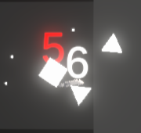
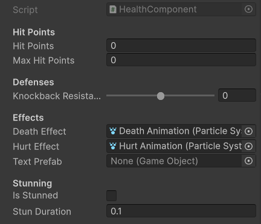

# Mini-Jam-186: Evo Square
This project is a submission for the 186th Mini Jam on itch.io. This mini jam had a theme and a restriction. The theme was **Evolution** and the restriction was **Failure is Progress**. The project I submitted was called Evo Square.

Evo Square is where the player plays as a square which was six different statistics or "stats" that define how strong the square is:
* **Strength**, How much damage you deal with heavy weapons.
* **Dexterity**, How much damage you deal with light weapons.
* **Constitution**, your maximum hit points.
* **Speed**, how fast you move around the world.
* **Magic**, how much damage you deal with magic.

Each stat increases the more you use it. For example: the more you attack with the heavy _Greataxe_, the more your strength stat increases. But there is a catch! The stats only increase if you die. Meaning that failure is how you get stronger, or _evolve_ in Evo Square. This defines the basic gameplay loop: Fight Enemies => Die => Increase Stats => Fight Enemies.

## Usage
The finished game can be played on its itch.io page here. The game runs in your browser and requires full screen to work correctly. (Will be fixed in a future update.)
___
## The  Jam
Game Jams at their core, are learning experiences. The force developers to engage with material they may not be familiar with in a short amount of time. They are excellent for coming up with ideas, learning new things, and having fun. This section describes the process of making this game for the Jam, both the successes and difficulties.

### Difficulties & New Concepts
#### Animation by Transform
In the game, the player can pick up a variety of weapons. For the game jam release those weapons are:
* Greataxe (Strength)
* Scimitar (Dexterity)
* Lute (Magic)

In order to make the game to feel responsive and fun to play, animations were needed to make it look like the square is swinging the weapons or playing the lute. For this, I used Animation via manipulating the transform. While this looked good in a standalone animation it did not work correctly during the game, because as the time, the implementation for the weapon was incompatible. The weapons implementation was to set the object's transform and rotation along with the player, which was overriding the animation. The solution was to make a child of the player that is constantly having its transform updated, and have the Weapon become a child of this game object which we will call "player hand". Since the weapon's origin position and rotation was relative to the player hand, the animations now work correctly.

#### Persistent Game Data
In order for this game to work at a fundamental level, the game needed persistent data between scenes. This was a new topic for me to learn as a game developer. In order to achieve this functionality, I created a game object that would persist between scenes.

**Note: This implementation does not persist between game instances.**

Once I had a game object I created a script and declared a static instance of the script:
```csharp
public static PlayerStats Instance;
```
Then, whenever the game object is loaded, tell the engine to not destroy the instance upon loading:
```csharp
void Awake()
    {
        if (Instance == null)
        {
            Instance = this;
            DontDestroyOnLoad(this);
        }
        else
        {
            Destroy(gameObject);
        }
    }
```
All that was left was to interact with this persistent data through the following reference, with replacing `[desiredStat]` with one from Strength, Dexterity, Constitution, Speed, and Magic:
```csharp
PlayerStats.Instance.[desiredStat];
```

### Successes

#### Damage Number Indications
One good way to improve the User Experience for the player is to provide feedback on enemy hits. This game implements damage number indicators, which are numbers that appear over the enemy to indicate how much damage was done to the enemy.

<div style = "text-align: center">
  
</div>

<p style = "text-align: center";>The red is damage the player takes, the white is damage the enemy takes.</p>

This is accomplished by instantiating a prefab with a child that has the 'text' component as a child. It needs to be a child so the text is relative to a game object and not the canvas. Then I added another transform animation to make the number raise up and get slightly bigger.

#### Health Component
In the game, many objects can take damage and potentially be destroyed. If an object is capable of being damaged, they are given the `Health Component`.

<div style = "text-align: center">
  
</div>

This design was very effective, as it allowed me to easily create new enemies if needed that can have different particle effect systems, hit point values, or knockback resistance. This component is present on both the enemy and the player. In the Game Jame Release version of the game, the player and the enemies chance the same hurt and death particle systems.

In the Game Jam Release version, there are some parts of the `Health Component` that would benefit from code revision.

#### Camera Motion
In the game, I programmed the camera motions manually. The game level consists of a series of randomly generated rooms. In order to have a clean transition between these rooms via the camera, I trigger code that utilizes `Vector2 lerp` in order to smoothly move the camera from one position to another, whenever the player overlaps another room (which occurs on the pathways between rooms.)

Whenever the player overlaps a room, the game will call this function:
```csharp
public void ShiftCamera(Vector2 nextRoom)
    {
        GameObject targetRoom = _dc.DungeonMap[nextRoom];
        
        currentCamPos = new Vector3(transform.position.x, transform.position.y, -10);
        targetCamPos = new Vector3(targetRoom.transform.position.x, targetRoom.transform.position.y, -10);
        _cameraTime = 0;
        
        currentRoom = _dc.DungeonMap[nextRoom];
        
    }
```
The script gets a reference to the new room game object through the `DungeonMap[Vector2]` dictionary, and then sets `targetCamPos` to the position of this new room. In the `Update()`event, there is a `Vector2 lerp` methods telling the camera to smoothly transition between `currentCamPos` and `targetCamPos`.


### Lessons Learned & Future Plans

#### Improve User Experience
Improving the UX and making the game more fun to play is always a never ending endeavor, but there are two explicit ways to improve the game; preventing the "death" screen from moving away too quickly and improving the responsiveness of the weapons.

The "death" screen that appears when you die shows the player their stats and increases to those stats, but this screen will also reload the scene if the player presses the space bar. Since player's will be pressing the space bar frequently when fighting, and fighting monsters is when the player is prone to die, there is a very high chance the player will press the space bar on accident and immediate reload the scene. One way to improve this is to prevent the space bar from working for some time, to account for any player cause false negatives (and make the UI delay the `Press Space to Continue` message).

Improving the responsiveness of the weapons includes many things like adding better animations, adjusting weapon sizes, adding more sound effects, and adding hit time. Hit time is the game pausing very briefly to make the impact of a hit feel more impactful. All these elements come together to make the weapons fun to use, and feel destinct. For instance if a player wishes to use the greataxe, the UX should support the feeling of using a slow, heavy, impactful weapon.

#### Improve Map Generation Algorithm
During development of the procedurally generated "dungeon map" I devised the following algorithm:
```csharp
bool InitalizeRoom(Direction inComingDirection, Vector2 roomLocation)
    {
        roomCount++;
        
        //Create and Add the Room to the Map
        GameObject newRoom = Instantiate(dungeonRooms[0], new Vector3(roomLocation.x * roomBuffer, roomLocation.y * roomBuffer, 25), Quaternion.identity);
        RoomComponent newRoomComponent = newRoom.GetComponent<RoomComponent>();
        newRoomComponent.roomLocation = roomLocation;
        DungeonMap.Add(roomLocation, newRoom);
        
        //Initalize opposite path
        switch (inComingDirection)
        {
            case Direction.North:
                newRoomComponent.south = true;
                break;
            case Direction.South:
                newRoomComponent.north = true;
                break;
            case Direction.East:
                newRoomComponent.west = true;
                break;
            case Direction.West:
                newRoomComponent.east = true;
                break;
        }
        
        //1/2 chance to enable/disable paths
        int directionChoice = Random.Range(1, 4);
        if (directionChoice == 1 && !newRoomComponent.north && roomCount < maxRooms)
        {
            newRoomComponent.north = true;
            InitalizeRoom(Direction.North, roomLocation + new Vector2(0, 1));
        }
        if (directionChoice == 2 && !newRoomComponent.east && roomCount < maxRooms)
        {
            newRoomComponent.east = true;
            InitalizeRoom(Direction.East, roomLocation + new Vector2(1, 0));
        }
        if (directionChoice == 3 && !newRoomComponent.south && roomCount < maxRooms)
        {
            newRoomComponent.south = true;
            InitalizeRoom(Direction.South, roomLocation + new Vector2(0, -1));
        }
        if (directionChoice == 4 && !newRoomComponent.west && roomCount < maxRooms)
        {
            newRoomComponent.west = true;
            InitalizeRoom(Direction.West, roomLocation + new Vector2(-1, 0));
        }
        
        return true;
    }
```
In a nutshell, this algorthim will, on the given room, decide which of the four exits should lead to another room, and if so, create another room. Then it performs this same operation again once a room is created, with `maxRooms` limiting the size of the dungeon, so it does not generate an infinite amount of rooms.

The current algorithm is flawed, because it only can choose one path on a room to create another room at, making a very linear dungeon. This was primarily due to time constraints; ensuring the gameplay loop was operational was a bigger priority than a procedural dungeon.

To Improve, I would ensure that any of the empty paths have a chance of generating a new path, with the chance decreasing for every subsequent room in a chain. This should lead to a more varied dungeon map. I am keeping in mind that the entire algorithm may need a rewrite.

#### Adjustable User Interface
In the Game Jam release of the game, one of the biggest issues is the lack of adjustable UI. The UI currently is only visible properly on a 1920 x 1080 pixel resolution. It is a major issue because  not everyone has a resolution this size. One of the first issues that I will be fixing is the UI sizing issue.

#### Improve Enemy AI
In the Game Jam release of the game, the enemies currently will lazily and rarely move about the dungeon rooms, making them look "messy", almost like a bunch of stuff spilled on the floor. Enemy AI is a concept I am not currently very familiar with the design patterns for, so research will be required in order to improve the AI.

#### More Weapons & Special Weapons
To add to the game, more weapons could make the game more interesting some basic weapons could be:
* Handaxe - Strength, Low Damage, Thrown
* Bow - Dexterity, Ranged
* Wand - Magic, Fireball AOE

Furthermore, I have ideas for special versions of existing weapons:
* _Axe of Quakes_ - Greataxe, Launches Enemies Back
* _Scimitar of Frost_ - Scimitar, Freezes Enemies in Place
* _Electric Guitar_ - Lute, Produces a Chain Lightning Effect

These special weapons would not be available at the beginning of the run, instead must be acquired in the dungeon and are lost on death.

#### Goals and Gameplay Loop
In the Game Jame Release of the game, there is not a good reason to explore the dungeon or even get stronger besides "number go up". One way to improve this would be to add some kind of loot to the dungeon, providing incentive to explore. Another would be to add some kind of "boss" to fight, but this boss is very tough, so training skills beforehand and finding powerful loot is necessary.

In general, gameplay loop and feel are new concepts for me to expeirnce because this is one of the first games I have completed most of the foundational code and premise without losing interest.

### Final Thoughts
This Game Jam was an exceptional learning experience for me. I would consider this game to be my first finished, minimum viable product, I have produced for a Game Jam. In reflection, the scope of this game is too large for the man power available (just me) and the time I had to make the game. This scope issue led to the game having a lack of polish, and me submitting about 1 hour before the deadline, despite the game not being completely play tested. In fact, the following developer command was left in the release version of the game:
```csharp
//TODO: REMOVE AFTER TESTING
if (Input.GetKeyDown(KeyCode.LeftShift))
    GetComponent<HealthComponent>().HitTarget(5, Vector2.zero);
```